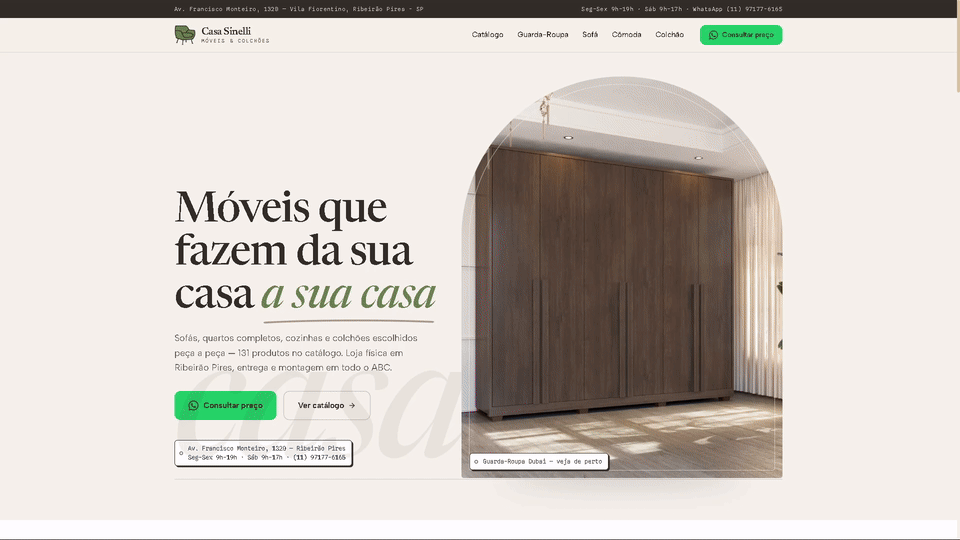
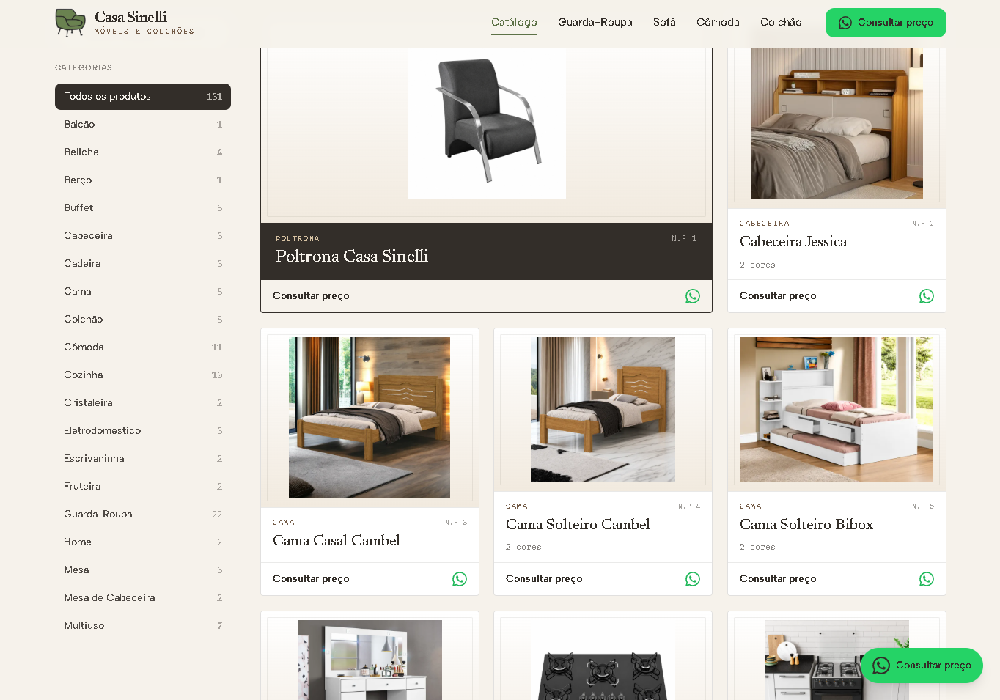
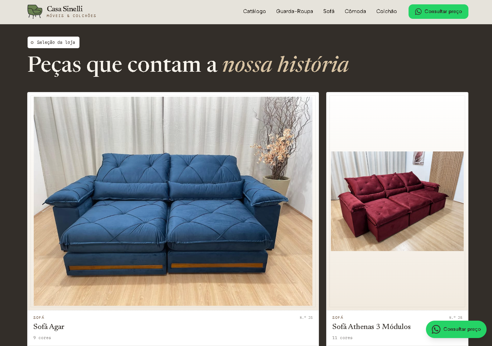
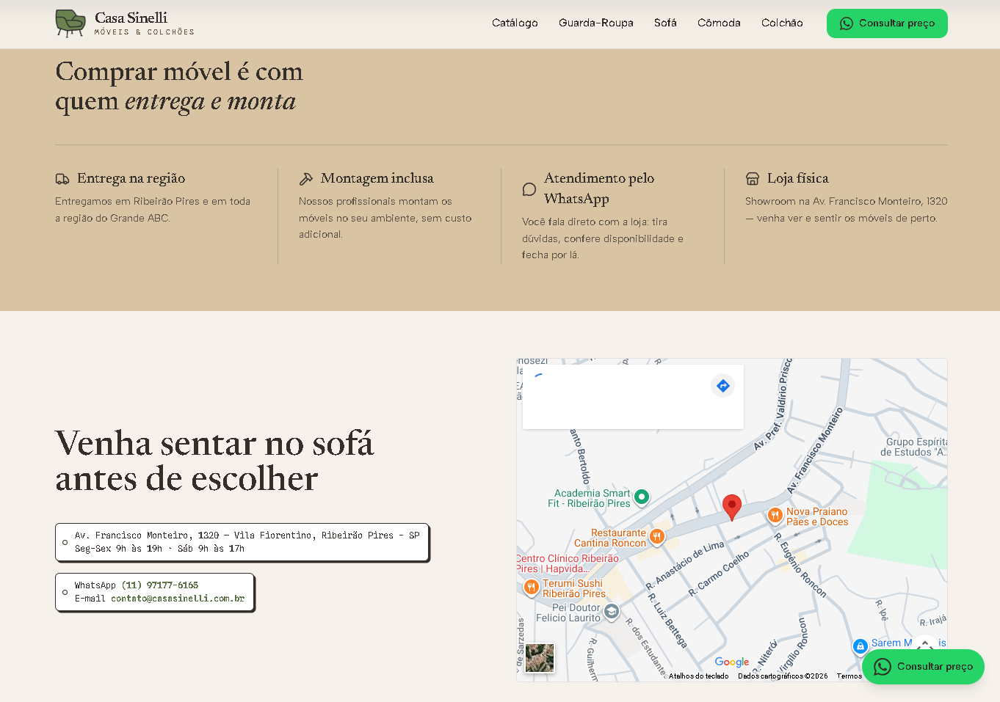
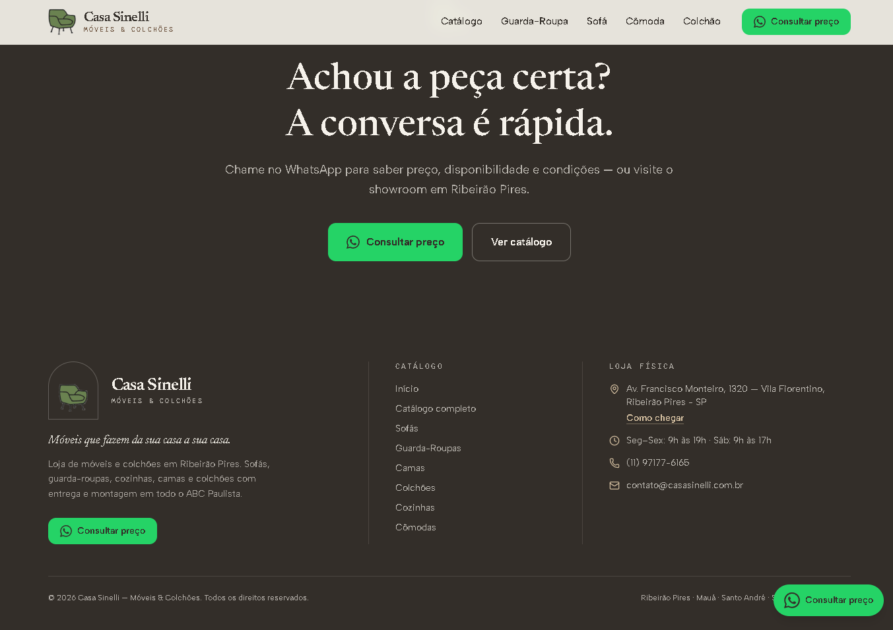
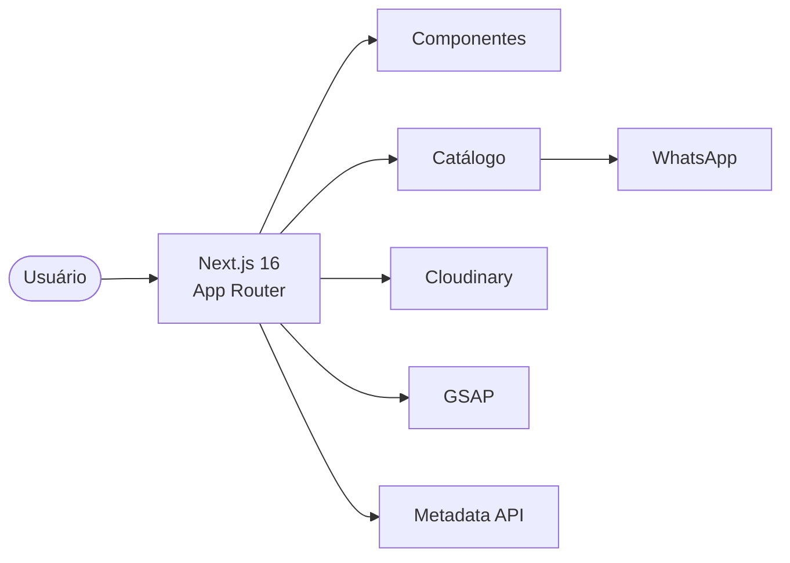

# Casa Sinelli
<p align="center">
  
</p>

> Aplicação web desenvolvida para a Casa Sinelli, uma loja de móveis e colchões de Ribeirão Pires (SP), construída com Next.js 16 e React 19 para oferecer um catálogo moderno, responsivo e otimizado para SEO, proporcionando uma navegação fluida e contato direto com a loja via WhatsApp.

O projeto segue uma organização baseada em funcionalidades, separando rotas, componentes reutilizáveis, dados e utilitários.

------------------------------------------------------------------------

# Demonstração

**Produção**

https://www.casasinelli.com.br/

> Acesse a aplicação publicada para visualizar o catálogo completo e a experiência de navegação desenvolvida para a Casa Sinelli.

------------------------------------------------------------------------
## Screenshots

<p align="center">
  
  
</p>

<p align="center">
  
  
</p>

------------------------------------------------------------------------

## Tecnologias

- Next.js 16
- React 19
- TypeScript
- Tailwind CSS 4
- GSAP
- Cloudinary
- Vercel Analytics
- Playwright


------------------------------------------------------------------------

## Objetivos

- Modernizar a presença digital da Casa Sinelli.
- Centralizar o catálogo de produtos.
- Facilitar o contato via WhatsApp.
- Melhorar a experiência em dispositivos móveis.
- Utilizar tecnologias modernas do ecossistema React.

------------------------------------------------------------------------

## Diferenciais

- Catálogo organizado por categorias
- Página individual para produtos
- Seleção de variações de cores
- Integração direta com WhatsApp
- Arquitetura baseada em componentes
- Otimização de imagens com Cloudinary
- Interface responsiva
- SEO com Metadata API

------------------------------------------------------------------------

# Sobre o projeto

O Casa Sinelli Website foi desenvolvido para apresentar o catálogo de
produtos da loja de forma moderna, rápida e responsiva.

O fluxo da aplicação foi projetado para reduzir a quantidade de interações entre a descoberta de um produto e o contato com a equipe comercial.

------------------------------------------------------------------------
## Destaques

- Arquitetura utilizando Next.js App Router.
- Catálogo organizado por categorias.
- Integração direta com WhatsApp.
- Otimização de imagens via Cloudinary.
- Interface responsiva.
- Motion Design utilizando GSAP.
- SEO utilizando Metadata API.

------------------------------------------------------------------------

# Funcionalidades

-   Catálogo organizado por categorias
-   Página individual de produtos
-   Variações de produto
-   Integração direta com WhatsApp
-   Layout responsivo
-   Animações utilizando GSAP
-   Otimização de imagens
-   SEO utilizando Metadata API do Next.js

------------------------------------------------------------------------

# Stack

  Tecnologia         Utilização
  ------------------ -----------------------------
  Next.js 16         Framework
  React 19           Interface
  TypeScript         Linguagem
  Tailwind CSS 4     Estilização
  GSAP               Animações
  Cloudinary         CDN e otimização de imagens
  Lucide React       Ícones
  Vercel Analytics   Analytics
  Playwright         Testes end-to-end

------------------------------------------------------------------------

## Arquitetura



------------------------------------------------------------------------

# Performance

O projeto utiliza recursos nativos do Next.js para otimizar o carregamento das páginas, combinando renderização moderna, componentização reutilizável, otimização de imagens e carregamento eficiente de recursos.

### Otimizações implementadas

- App Router
- Componentização reutilizável
- Cloudinary
- Metadata API
- Vercel Analytics
- Lazy Loading
- Otimização de imagens

------------------------------------------------------------------------

## Experiência do usuário

```text
Página Inicial
      │
      ▼
Categorias
      │
      ▼
Produto
      │
      ▼
Consultar preço
      │
      ▼
WhatsApp
```
------------------------------------------------------------------------

# SEO

O projeto utiliza a Metadata API do Next.js para definir informações importantes de indexação em cada página, contribuindo para melhor visibilidade em mecanismos de busca.

- Title
- Description
- Keywords

------------------------------------------------------------------------

## Aprendizados

Durante o desenvolvimento foram aprofundados conhecimentos em:

- Next.js App Router
- Componentização
- TypeScript
- GSAP
- Cloudinary
- Responsividade
- SEO

------------------------------------------------------------------------

## Design

O layout foi desenvolvido priorizando simplicidade, legibilidade e conversão.

A identidade visual utiliza tons neutros, tipografia serifada para títulos e elementos modernos para chamadas de ação, buscando transmitir sofisticação e confiabilidade.

------------------------------------------------------------------------

# Estrutura do Projeto

``` text
src
├── app            # Rotas (App Router)
├── components     # Componentes reutilizáveis
├── data           # Dados do catálogo
├── hooks          # Hooks customizados
├── lib            # Utilitários
├── public         # Arquivos estáticos

docs               # Documentação e imagens do README
scripts            # Scripts auxiliares
```

------------------------------------------------------------------------

# Como executar

``` bash
git clone https://github.com/Raphael-Sinelli/casa-sinelli-site

cd casa-sinelli-site

npm install

npm run dev
```

------------------------------------------------------------------------

# Scripts

  Comando                  Descrição
  ------------------------ ----------------------------------------
  npm run dev              Inicia o ambiente de desenvolvimento
  npm run build            Gera a build de produção
  npm run start            Executa a aplicação em produção
  npm run lint             Verifica o código
  npm run gerar-produtos   Gera os dados utilizados pelo catálogo

------------------------------------------------------------------------

# Documentação

O projeto possui documentação complementar:

-   README.md
-   docs/
-   CLAUDE.md
-   AGENTS.md

------------------------------------------------------------------------

# Licença

Este projeto utiliza uma licença proprietária. Consulte o arquivo LICENSE para mais informações.

------------------------------------------------------------------------

## Status

🟢 Em produção

Website publicado e utilizado como site institucional da Casa Sinelli.

------------------------------------------------------------------------

## Arquivos de Configuração

O projeto utiliza arquivos de configuração para padronizar o ambiente de desenvolvimento e build.

- next.config.ts
- tsconfig.json
- eslint.config.*
- package.json

------------------------------------------------------------------------

## Autor

Raphael Sinelli

Tecnólogo em Análise e Desenvolvimento de Sistemas — FIAP

- GitHub: <https://github.com/Raphael-Sinelli>
- Website: <https://www.casasinelli.com.br>
- E-mail: raphaelsinelli@gmail.com


